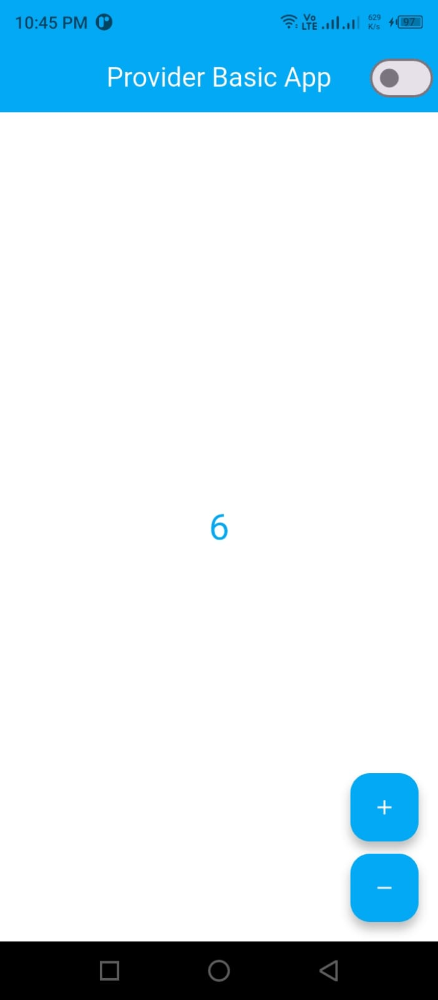

# Provider Basics App

A Flutter application demonstrating **Provider state management** using `ChangeNotifier`.  
This app implements a **counter** and **theme switching** (light/dark mode), showcasing the **separation of UI and business logic** using Provider.

---

##  Objective

- Learn **Provider fundamentals** and `ChangeNotifier`.
- Implement a counter with **increment** and **decrement** functionality.
- Apply **theme switching** across the app using Provider.
- Demonstrate **reactive UI updates** and proper **state management**.
- Maintain **separation of business logic from UI**.

---

##  Features

- Counter with **Increment** and **Decrement** buttons
- Theme switching between **Light** and **Dark** modes
- Reactive UI updates using `Consumer` and `context.watch()`
- Separation of UI and business logic using `CounterProvider` and `ThemeProvider`

---


---

##  Screenshots

### Light Theme


### Dark Theme


##  Installation & Setup

1. Clone the repository:

```bash
git clone https://github.com/yourusername/provider_basics_app.git
cd provider_basics_app


